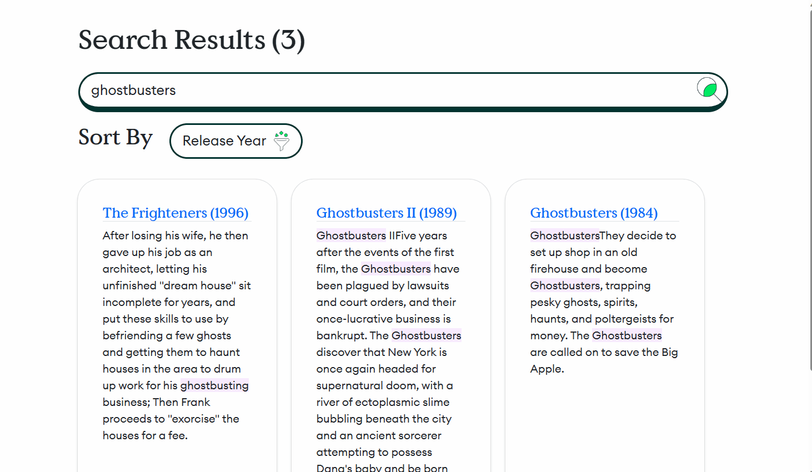
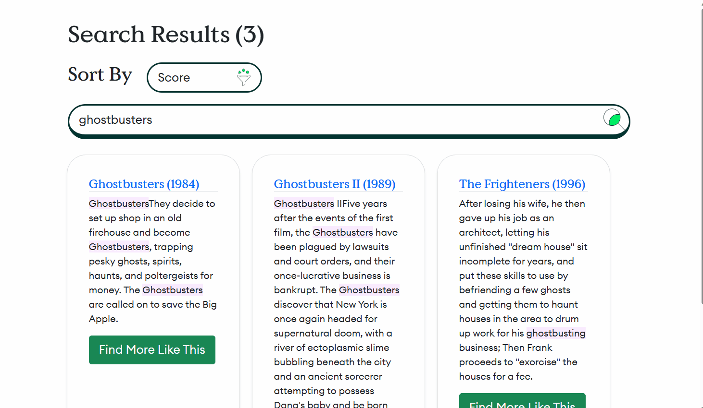
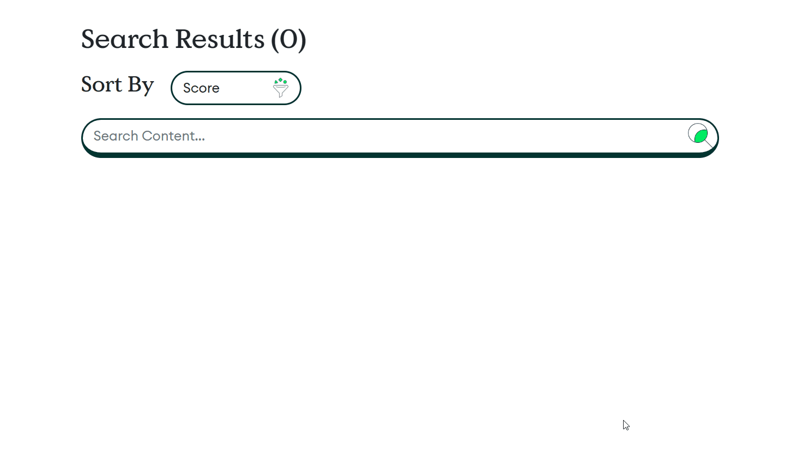
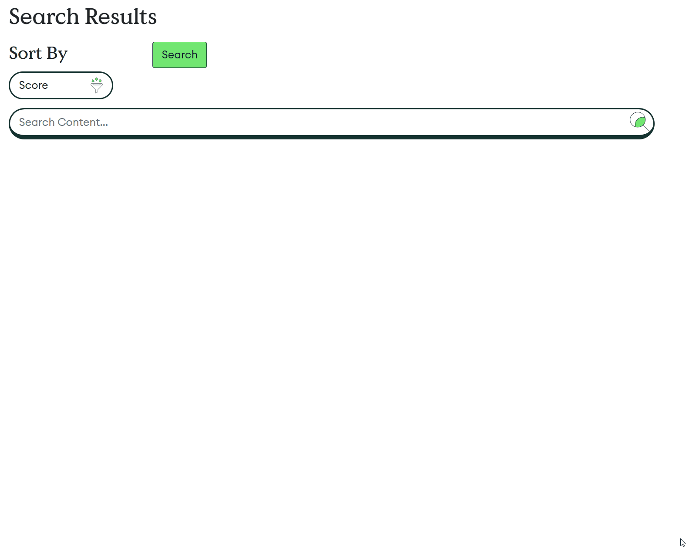

# Atlas Search for NYC .LOCAL 2023

## Not using Search, Looking Up By _id

See source code in [Results01](AtlasSearchNYC/Pages/Results01.razor)

## Basic Search with Dynamic Index

See source code in [Results02](AtlasSearchNYC/Pages/Results02.razor) and its [default index definition](Indexes/default.json)

## Refined Index with Scoring and Sorting

See source code in [Results03](AtlasSearchNYC/Pages/Results03.razor) and its [sort index definition](Indexes/sort.json)

## More Like This

See source code in [Results04](AtlasSearchNYC/Pages/Results04.razor) and its [sort index definition](Indexes/sort.json)

## Autocomplete

See source code in [Results05](AtlasSearchNYC/Pages/Results05.razor) and [SearchBarAutocomplete](AtlasSearchNYC/Shared/SearchBarAutocomplete.razor) and its [autocomplete index definition](Indexes/autocomplete.json)

## Facets

See source code in [Results06](AtlasSearchNYC/Pages/Results06.razor) and its [facet index definition](Indexes/facets.json)

## Less commmon uses for Facets

See source code in [Results06](AtlasSearchNYC/Pages/Results06.razor) and [MovieDetails](AtlasSearchNYC/Shared/MovieDetails.razor) and its [facet index definition](Indexes/facets.json)

