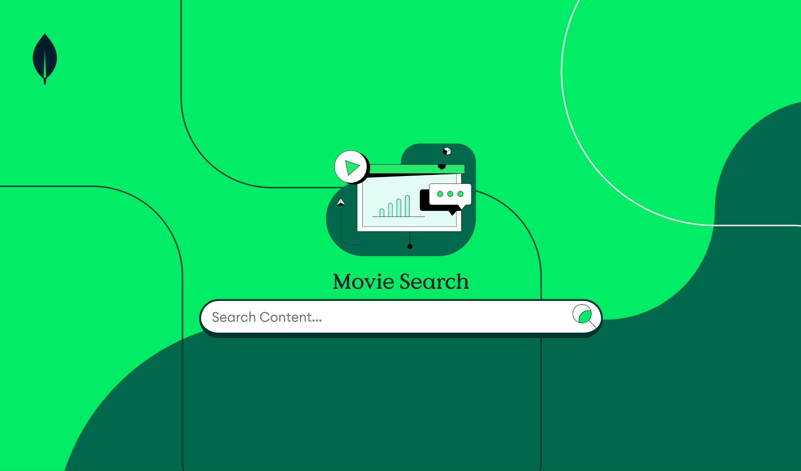

# Atlas Search for NYC .LOCAL 2023

## Not using Search, Looking Up By _id

See source code in [Results01](AtlasSearchNYC/Pages/Results01.razor)

## Basic Search with Dynamic Index

See source code in [Results02](AtlasSearchNYC/Pages/Results02.razor) and its [default index definition](Indexes/default.json)

## Refined Index with Scoring and Sorting

See source code in [Results03](AtlasSearchNYC/Pages/Results03.razor) and its [sort index definition](Indexes/sort.json)

## More Like This

See source code in [Results04](AtlasSearchNYC/Pages/Results04.razor) and its [sort index definition](Indexes/sort.json)

## Autocomplete

See source code in [Results05](AtlasSearchNYC/Pages/Results05.razor) and [SearchBarAutocomplete](AtlasSearchNYC/Shared/SearchBarAutocomplete.razor) and its [autocomplete index definition](Indexes/autocomplete.json)

## Facets

See source code in [Results06](AtlasSearchNYC/Pages/Results06.razor) and its [facet index definition](Indexes/facets.json)

## Less commmon uses for Facets

See source code in [Results06](AtlasSearchNYC/Pages/Results06.razor) and [MovieDetails](AtlasSearchNYC/Shared/MovieDetails.razor) and its [facet index definition](Indexes/facets.json)

## Vector search
As of MongoDB .Local NYC 2023, [MongoDB announced a Public Preview of Vector Search](https://www.mongodb.com/products/platform/atlas-vector-search). The default data set for movies now distributes a collection which uses OpenAI's `ada-002-text` embeddings.

To use this feature, in your `.env` file include the additional `OPENAI` environment variables. Note that the app can use the native OpenAI API (only use `OPENAIAPIKEY`) or Azure's (use `OPENAIAPIKEY` and `OPENAIDEPLOYMENT` and `OPENAIENDPOINT`)

# Recording

<iframe width="560" height="315" src="https://www.youtube.com/embed/Xu_AZlBp07U" title="YouTube video player" frameborder="0" allow="accelerometer; autoplay; clipboard-write; encrypted-media; gyroscope; picture-in-picture; web-share" allowfullscreen></iframe>
